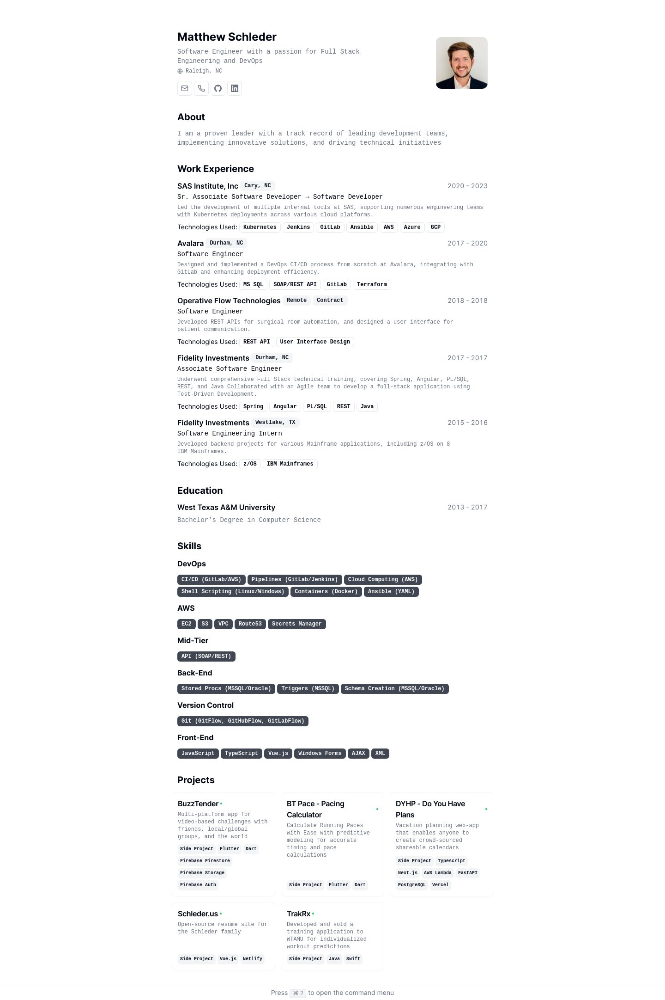

# Minimalist CV

Simple web app that renders minimalist CV with print-friendly layout.

Built with Next.js and shadcn/ui, deployed on Vercel.

# Getting Started Locally

1. Clone this repository to your local machine:

   ```bash
   git clone https://github.com/MatthewSchleder/matt-cv.git
   ```

2. Install dependencies:

   ```bash
   yarn install
   ```

3. Start the local Server:

   ```bash
   yarn dev
   ```

# License

[MIT](https://choosealicense.com/licenses/mit/)
